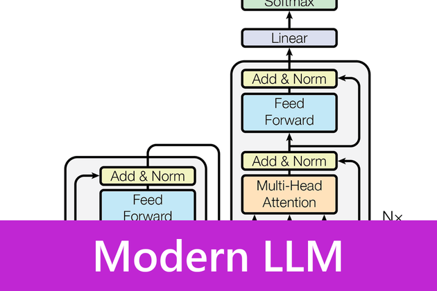
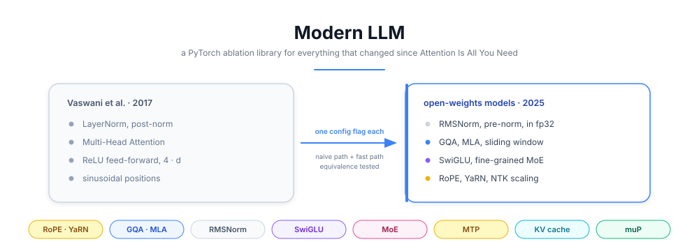
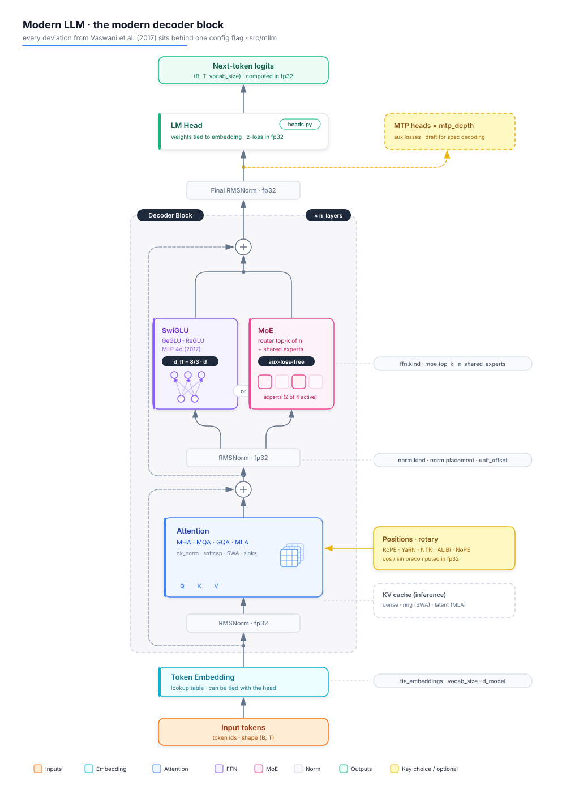

# 🧬 Modern LLM


<p align="center">
  
</p>

<p align="center">
  
</p>

---

## 📝 Project Description

Nobody trains the Transformer of **Vaswani et al. (2017)** anymore. Every open-weights model released since **LLaMA** replaced its normalization, its positions, its attention and its feed-forward, one paper at a time. This library rebuilds those deviations in **PyTorch**, each one behind a config flag, so they can be switched on and off and compared.

It is an **ablation library, not a model**. Every component ships with a **naive reference implementation** (readable, slow) plus the fast path, and a numerical equivalence test between the two. That equivalence test is the whole point, it is what separates a reference implementation from a plausible one.

The goal is to answer a question that papers rarely answer directly: **which of these techniques actually earn their complexity, and at what scale**.

✅ **All seven milestones are done and green.** The library trains, generates and benchmarks end to end, and [docs/ablations.md](docs/ablations.md) reports what each component was actually worth.

---

## ⚙️ Features

  🧩 **One config flag per deviation**, so a single field separates two runs that are otherwise identical

  🔬 **Naive path and fast path for every component**, with an equivalence test between them

  📐 **Five coherent profiles** shipped in `configs/`, from the vanilla 2017 block to a Gemma-style alternated model

  🚫 **No config activates everything at once**, because a model that stacks every brick is the counter-example this repo teaches against

  📄 **29 reference papers downloaded and indexed**, each module docstring citing its authors, year and arXiv id

  🎯 **Validation that fails loudly**, a typo in a YAML file raises instead of being silently ignored

  🧪 **Whole test suite runs on CPU in under 4 seconds**, so ablations stay cheap to check

---

## 🗂️ The deviations, one block of the 2017 architecture at a time

Each table below is one box of the original figure. For every component: **what
it actually does**, what it replaces, what it optimizes, the paper, and the flag
that switches it on.

**What the tags mean**

| Tag | Optimizes | The question it answers |
|---|---|---|
| 💾 | **Memory** | how much VRAM does one token of context cost |
| ⚡ | **Compute and energy** | how many FLOPs, or how fast at fixed FLOPs |
| 🎯 | **Quality** | better loss at an equal parameter or FLOP budget |
| 🛡️ | **Training stability** | does the run survive, and without babysitting |
| 📏 | **Long context** | does it still work past the training length |
| 🔧 | **Hyperparameter transfer** | can small model settings be reused at scale |

---

### 🟠 Input embedding

| Component | What it does | Replaces | Optimizes | Paper | Flag |
|---|---|---|---|---|---|
| **Byte-level BPE, large vocabulary** | Merges frequent byte pairs into single tokens, so a common word costs one forward pass instead of five | BPE at 32k to 37k | ⚡ 🎯 | GPT-2, 2019 | upstream of `mllm` |
| **Tied embeddings** | Reuses the input lookup table as the output projection, since both map between the same tokens and the same vector space | a separate output matrix | 💾 | [Press and Wolf, 2016](https://arxiv.org/abs/1608.05859) | `model.tie_embeddings` |

*A larger vocabulary means fewer tokens for the same text. It costs a bigger embedding table, which is exactly why tying matters more the smaller the model.*

---

### 🟡 Positional encoding

*2017: a fixed sinusoidal signal added to the embedding once, at the input. Position is absolute and competes with content inside the residual stream, where it dilutes with depth.*

| Component | What it does | Replaces | Optimizes | Paper | Flag |
|---|---|---|---|---|---|
| **RoPE** | **Rotates q and k by an angle proportional to their position.** Two vectors rotated by `m` and `n` have a dot product that depends only on `m - n`, so position lives inside the rotation of the vector itself and is never added to the residual stream | sinusoidal absolute embeddings | 🎯 📏 | [Su et al., 2021](https://arxiv.org/abs/2104.09864) | `position.kind: rope` |
| **ALiBi** | Subtracts a per-head multiple of the query-key distance from the score, penalizing far tokens linearly. No embedding, no parameter | any positional embedding | 📏 | [Press et al., 2021](https://arxiv.org/abs/2108.12409) | `position.kind: alibi` |
| **NoPE** | Injects nothing at all. The causal mask already breaks the symmetry between positions, and the model infers order from it | any positional embedding | 🎯 | [Kazemnejad et al., 2023](https://arxiv.org/abs/2305.19466) | `position.kind: nope` |
| **theta 10k to 500k** | Slows the lowest rotation frequencies, so they still resolve distances of thousands of tokens instead of wrapping around | theta fixed at 10000 | 📏 | [LLaMA 3, 2024](https://arxiv.org/abs/2407.21783) | `position.rope_theta` |
| **Position Interpolation** | Divides every position by the scale factor, squeezing a long context back into the range the model was trained on | nothing, 2017 had no extension | 📏 | [Chen et al., 2023](https://arxiv.org/abs/2306.15595) | `scaling.kind: linear` |
| **NTK-aware** | Raises `theta` instead of squeezing positions, spreading the interpolation across frequency bands so the fast ones keep their resolution | nothing | 📏 | community, then LLaMA 3 | `scaling.kind: ntk-aware` |
| **YaRN** | Interpolates only the slow bands and lets the fast ones keep extrapolating, plus a temperature on the attention scale to compensate for the changed distribution | nothing | 📏 🎯 | [Peng et al., 2023](https://arxiv.org/abs/2309.00071) | `scaling.kind: yarn` |

*RoPE alone does not extend context, it generalizes poorly past its training length. Everything from Position Interpolation down exists to patch that one problem afterwards.*

---

### 🔵 Multi-Head Attention

*2017: 8 heads, each with its own K and V projection. Everything below changed for the KV cache, not for quality.*

**Head layout**

| Component | What it does | Replaces | Optimizes | Paper | Flag |
|---|---|---|---|---|---|
| **MQA** | All query heads share **one single** key and value head, so the cache holds one pair per layer instead of `n_heads` | one KV pair per query head | 💾 ⚡ | [Shazeer, 2019](https://arxiv.org/abs/1911.02150) | `attention.kind: mqa` |
| **GQA** | Query heads are split into groups, each group sharing one key and value head. The middle ground between MHA and MQA | one KV pair per query head | 💾 ⚡ | [Ainslie et al., 2023](https://arxiv.org/abs/2305.13245) | `attention.kind: gqa` |
| **MLA** | Compresses keys and values into **one low-rank latent vector per token**, then folds the decompression matrices into the query and output projections so they never need materializing at inference | the KV cache itself | 💾 | [DeepSeek-V2, 2024](https://arxiv.org/abs/2405.04434) | `attention.kind: mla` |

**Score computation**

| Component | What it does | Replaces | Optimizes | Paper | Flag |
|---|---|---|---|---|---|
| **QK-Norm** | Normalizes q and k to unit RMS **before** the dot product, so attention logits are bounded by construction instead of drifting upward during training | raw q and k | 🛡️ | [Henry et al., 2020](https://arxiv.org/abs/2010.04245) | `attention.qk_norm` |
| **Logit softcapping** | Passes the scores through `c · tanh(x / c)`, capping them smoothly rather than letting them grow without limit | unbounded attention logits | 🛡️ | [Gemma 2, 2024](https://arxiv.org/abs/2408.00118) | `attention.logit_softcap` |
| **Sliding window** | Each token attends only to the last `w` positions, making attention linear in sequence length instead of quadratic | full quadratic attention on every layer | ⚡ 📏 | [Mistral 7B, 2023](https://arxiv.org/abs/2310.06825) | `attention.sliding_window` |
| **Local and global alternation** | Most layers use a window, one layer in N keeps full attention, so information can still cross the whole sequence at a fraction of the cost | all layers identical | ⚡ 📏 | [Gemma 3, 2025](https://arxiv.org/abs/2503.19786) | `attention.global_every` |
| **Attention sinks** | Keeps the first tokens permanently visible. Softmax has to put its mass somewhere, and those tokens are where a head parks it when nothing is relevant, so evicting them collapses the distribution | evicting the first tokens | 🛡️ 📏 | [Xiao et al., 2023](https://arxiv.org/abs/2309.17453) | `attention.attn_sinks` |
| **FlashAttention** | Computes the identical softmax in tiles small enough to stay in fast on-chip memory, never writing the `n × n` score matrix to VRAM | nothing mathematically, only memory traffic | ⚡ 💾 | [Dao et al., 2022](https://arxiv.org/abs/2205.14135) | `[flash]` extra, or SDPA |

*Decoding one token reads the whole cache and does little arithmetic with it, so the step is bound by memory bandwidth rather than by FLOPs. That is why shrinking the cache buys speed.*

---

### ⚪ Add & Norm

*2017: `LayerNorm(x + Sublayer(x))`, that is post-norm. A normalization sits on the residual path itself, which is why the original needed a 4000 step warmup to train at all.*

| Component | What it does | Replaces | Optimizes | Paper | Flag |
|---|---|---|---|---|---|
| **Pre-norm** | Normalizes the **input** of each sub-block instead of its output, leaving the residual path as a clean identity from the first layer to the last, so gradients reach the bottom unattenuated | post-norm, which needs warmup | 🛡️ | [Xiong et al., 2020](https://arxiv.org/abs/2002.04745) | `norm.placement: pre` |
| **RMSNorm** | Divides by the root mean square only, dropping both the mean subtraction and the bias that LayerNorm computes. One reduction instead of two | LayerNorm | ⚡ 🛡️ | [Zhang and Sennrich, 2019](https://arxiv.org/abs/1910.07467) | `norm.kind: rmsnorm` |
| **Sandwich norm** | Normalizes both before **and** after each sub-block, keeping the pre-norm identity path while also bounding what each block adds to the stream | a single norm per sub-block | 🛡️ | [Gemma 2, 2024](https://arxiv.org/abs/2408.00118) | `norm.placement: sandwich` |
| **Scaled residual init** | Divides the output projections by `sqrt(2 · n_layers)` at initialization, so the residual stream variance stops growing with depth | uniform init | 🛡️ | GPT-2, 2019 | `init.scaled_residual` |
| **DyT** | Replaces normalization entirely by `gamma · tanh(alpha · x) + beta`, with no reduction over the feature dimension, so there is no statistic to compute or synchronize | normalization itself | ⚡ | [Zhu et al., 2025](https://arxiv.org/abs/2503.10622) | `norm.kind: dyt` |

*Every statistic here must be computed in fp32 and cast back. This repo verifies that `torch.nn.functional.rms_norm` does not do it.*

---

### 🟣 Feed Forward

*2017: `max(0, xW₁ + b₁)W₂ + b₂` with `d_ff = 4·d`. Two thirds of the parameters of a block live here.*

| Component | What it does | Replaces | Optimizes | Paper | Flag |
|---|---|---|---|---|---|
| **SwiGLU, GeGLU, ReGLU** | Splits the input into a **value path and a gate path** and multiplies them elementwise, so the layer learns which coordinates to let through rather than applying one fixed activation. Three matrices instead of two, width dropped to `8/3 d` to keep the budget | the ReLU feed-forward of width `4·d` | 🎯 | [Shazeer, 2020](https://arxiv.org/abs/2002.05202) | `ffn.kind` |
| **Sparse MoE** | Replaces one feed-forward by `N` and routes each token to only `k` of them, so total parameters grow while FLOPs per token stay fixed | one dense feed-forward per layer | 🎯 at fixed ⚡ | [Shazeer et al., 2017](https://arxiv.org/abs/1701.06538) | `moe.enabled` |
| **Fine-grained experts** | Uses many small experts rather than a few large ones, which multiplies the number of usable expert combinations for the same parameter count | a few large experts | 🎯 | [DeepSeekMoE, 2024](https://arxiv.org/abs/2401.06066) | `moe.n_experts` |
| **Shared experts** | Keeps a few experts always active, so knowledge every token needs is stored once instead of being duplicated inside every routed expert | routing everything | 🎯 | [DeepSeekMoE, 2024](https://arxiv.org/abs/2401.06066) | `moe.n_shared_experts` |
| **Auxiliary loss** | Adds a penalty proportional to the product of each expert's load and its mean routing probability, minimized when both are uniform | nothing, without it the router collapses | 🛡️ | [Switch, 2021](https://arxiv.org/abs/2101.03961) | `moe.balance: aux_loss` |
| **Aux-loss-free balancing** | Adds a per-expert bias used **only for the top-k selection**, never for the weighting, nudged outside the gradient toward balance. Balancing therefore never enters the loss and never fights it | the auxiliary loss | 🛡️ 🎯 | [DeepSeek-V3, 2024](https://arxiv.org/abs/2408.15664) | `moe.balance: aux_loss_free` |
| **Router z-loss** | Penalizes the `logsumexp` of the router logits, keeping the gate in a numeric range bf16 can represent | unbounded router logits | 🛡️ | [ST-MoE, 2022](https://arxiv.org/abs/2202.08906) | `moe.router_z_loss_coef` |
| **MatFormer** | Nests smaller FFNs inside the large one as **literal sub-matrices**, all trained jointly, so a single checkpoint contains several deployable model sizes | one width per trained model | 💾 ⚡ | [Devvrit et al., 2023](https://arxiv.org/abs/2310.07707) | `ffn.mat_granularities` |

*On **MatFormer**, since two things are called Matryoshka: [Matryoshka Representation Learning](https://arxiv.org/abs/2205.13147) nests **embedding dimensions** for retrieval (what Nomic v1.5 does), while **MatFormer** nests **FFN widths** inside the Transformer (what Gemma 3n ships as E2B and E4B). Only the second applies to a decoder LLM, and only it is implemented here.*

---

### 🟢 Output head and objective

| Component | What it does | Replaces | Optimizes | Paper | Flag |
|---|---|---|---|---|---|
| **Output z-loss** | Penalizes the squared `logsumexp` of the logits, keeping them small enough that bf16 does not lose the tail of the softmax | unbounded logits | 🛡️ | [ST-MoE, 2022](https://arxiv.org/abs/2202.08906) | `train.z_loss_coef` |
| **Multi-Token Prediction** | Adds modules predicting tokens `t+2`, `t+3` and so on, so each position supervises several predictions instead of one. The modules are dropped at inference, or reused as a draft model | predicting one next token | 🎯 ⚡ | [Gloeckle et al., 2024](https://arxiv.org/abs/2404.19737) | `model.mtp_depth` |

---

### 🔧 Optimization

*Not part of the architecture, but the 2017 recipe changed completely.*

| Component | What it does | Replaces | Optimizes | Paper | Flag |
|---|---|---|---|---|---|
| **AdamW** | Applies weight decay directly to the weights instead of through the gradient, so it stops interacting with Adam's adaptive scaling | Adam with `beta2` 0.98 and plain L2 | 🛡️ 🎯 | [Loshchilov and Hutter, 2017](https://arxiv.org/abs/1711.05101) | `train.betas` |
| **Decay excluding norms and biases** | Skips weight decay on norm gains, biases and embeddings, since shrinking a gain shrinks the very signal that gain exists to rescale | decay on every parameter | 🎯 | current practice | `train.weight_decay` |
| **Warmup plus cosine** | Ramps the learning rate up over a few thousand steps, then anneals it smoothly toward zero | the inverse square root schedule | 🛡️ | GPT-3, 2020 | `train.schedule: cosine` |
| **WSD** | Warms up, holds a **constant plateau**, then decays only over the last steps, so the total run length is not fixed before the run starts | cosine, which locks the token budget upfront | 🔧 | [MiniCPM, 2024](https://arxiv.org/abs/2404.06395) | `train.schedule: wsd` |
| **muP** | Scales initialization and learning rate with width so activations keep the same magnitude at any `d_model`, which makes a learning rate tuned on a small model correct on a large one | retuning the learning rate at every width | 🔧 | [Yang et al., 2022](https://arxiv.org/abs/2203.03466) | `mup.enabled` |
| **bf16 with fp32 master weights** | Runs the matmuls in reduced precision while keeping a full precision copy of the weights for the updates, so small gradients are not rounded away | fp32 everywhere | ⚡ 🛡️ | [Micikevicius et al., 2017](https://arxiv.org/abs/1710.03740) | `train.precision` |

---

### ⏩ Inference

*Absent from the 2017 paper, which never discusses autoregressive decoding cost.*

| Component | What it does | Replaces | Optimizes | Paper | Flag |
|---|---|---|---|---|---|
| **KV cache** | Stores the keys and values of past tokens so each new token attends to them directly, turning an `O(n²)` cost into `O(n)` | recomputing the prefix at every token | ⚡ | standard practice | `cache.py` |
| **Ring buffer cache** | Overwrites the oldest slot in place, since a windowed layer can never read past `w` positions anyway. **This is where the sliding window saving actually comes from** | a dense cache on windowed layers | 💾 | [Mistral 7B, 2023](https://arxiv.org/abs/2310.06825) | `cache.RingCache` |
| **Latent cache** | Stores MLA's single compressed vector per token instead of every key and value head | storing every KV head | 💾 | [DeepSeek-V2, 2024](https://arxiv.org/abs/2405.04434) | `cache.LatentCache` |
| **Speculative decoding** | A cheap model drafts `gamma` tokens, the target verifies all of them in **one** pass, and a rejection rule keeps a correct prefix. Done right the output distribution is **exactly** the target's, so it is free latency | one forward pass per generated token | ⚡ | [Leviathan et al., 2022](https://arxiv.org/abs/2211.17192) | `generate.py` |

---

## 📊 What the components were actually worth

The whole point of the library. Full method, caveats and five more tables in
**[docs/ablations.md](docs/ablations.md)**. Below: 6 layers, `d_model` 256, byte
level, **2.46M tokens per variant**, identical seed, one config field changed at
a time, corpus frozen at sha `69a497f3a393`.

**Deviating from the 2017 block**

| Change | val loss | effect | params |
|---|---|---|---|
| `vanilla-2017` | 3.9280 | reference | 4.80M |
| **RoPE** instead of sinusoidal | 1.9131 | **-2.015** | 4.80M |
| **pre-norm** instead of post-norm | 3.3768 | **-0.551** | 4.80M |
| RMSNorm instead of LayerNorm | 3.3439 | -0.033 | 4.80M |
| SwiGLU instead of ReLU `4d` | 3.9270 | -0.001 | 4.80M |
| scaled residual init | 3.9271 | -0.001 | 4.80M |
| **all four together** | **1.8599** | **-2.068** | 4.78M |

**Deviating from that modern socle**

| Change | val loss | effect | params | deployed |
|---|---|---|---|---|
| **MTP depth 1** | **1.8211** | **-0.039** | 5.70M | 4.78M |
| MQA or GQA g=4 | 1.8500 | -0.010 | 4.19M | 4.19M |
| QK-norm | 1.8522 | -0.008 | 4.78M | 4.78M |
| MoE, 8 experts top 2 | 1.8544 | -0.006 | 8.26M | 8.26M |
| MatFormer, widths 1.0 / 0.5 / 0.25 | 1.8644 | +0.005 | 4.78M | 4.78M |
| sliding window 128 | 1.8778 | **+0.018** | 4.78M | 4.78M |
| **everything at once** | **1.8725** | **+0.013** | **10.70M** | 7.67M |

**Positions dominate everything else.** RoPE alone is 97% of the total gain, and
nothing else in the sweep is within an order of magnitude of it. Pre-norm is the
second real win, for a placement change that costs nothing.

**The bottom rows are the lesson the repo was built to make concrete.** Sliding
window *costs* quality, MoE buys almost nothing for 1.7x the parameters, and
stacking every brick gives a model with **2.2x the parameters and a worse loss**
than the plain socle. These techniques solve problems a 5M parameter model does
not have, so at this scale they are pure complexity.

Which combination actually wins is the next section, and it is not the one you
get by adding these rows up.

---

## 🏆 The best configuration, measured

`configs/best.yaml`. **Not** assembled by adding up the winning flags, which is
how people build models that are worse than their parts. Every combination below
was trained on the same frozen corpus for the same token budget, and this one
won on **both axes at once**: lowest held-out loss *and* smallest deployed
model.

| Slot | Choice | Measured effect | Why this and not the alternative |
|---|---|---|---|
| **Positions** | RoPE, `theta` 10000 | **-2.015** loss | The largest single effect measured anywhere in this repo. Raise `theta` to 500000 past ~8k context |
| **Add & Norm** | RMSNorm, pre-norm | **-0.551** loss | Pre-norm removes the warmup requirement outright. RMSNorm adds -0.033 and is cheaper |
| **Attention** | **MQA** (`n_kv_heads: 1`) | **-0.044** loss | Beat GQA g=4 at equal depth (1.8039 against 1.8244) *and* gives the smallest KV cache of any dense variant |
| **Score computation** | QK-norm **off** | **+0.030** if switched on | Helps against the socle (-0.008) and on a GQA + MTP-1 model (-0.036), but *costs* on this combination. See the note below |
| **Feed-forward** | SwiGLU, `8/3 d` | -0.001 loss | No measurable effect at 6 layers. Kept on the published evidence at scale, since it costs nothing |
| **Head** | **MTP depth 2** | **-0.044** loss | Best single addition. The modules are dropped at inference, so the deployed model is *smaller* than the trained one |
| **Init** | scaled residual | -0.001 loss | No depth to correct at 6 layers. Kept because a 12 layer model has some |
| **Optimizer** | AdamW, WSD schedule | not ablated | WSD keeps the token budget open, so a pod can be stopped and the run extended |

**Result**: `val loss 1.8039` against `1.8599` for the plain modern socle, with
**4.10M deployed parameters against 4.78M**. Better and smaller.

**Why QK-norm is off is the most instructive row in the table.** It improves the
socle, and improves a GQA plus MTP-1 model even more. Assembling a config by
adding up winners would switch it on. Measured on the winning combination it
costs `+0.030`, more than MTP gained. Individually good changes do not compose,
which is why every row above comes from a measured combination rather than a sum
of measured parts.

### What is deliberately absent, and what it cost to find out

| Not in the best config | Measured | Verdict |
|---|---|---|
| **MoE**, 8 experts top 2 | -0.006 loss for **1.7x** the parameters | this scale is not capacity limited |
| **Sliding window** 128 | **+0.018** loss | removes information the model was using |
| **MLA** | 4.1x faster absorbed than naive, still behind MHA here | only pays once the cache is the bottleneck |
| **Everything at once** | **+0.024** loss for **10.70M** parameters | see below |

That last row is the point of the whole repository. Stacking every brick gives a
model with **2.2x the parameters, 1.9x the deployed size, and a worse loss** than
the winner. It is slower, larger, harder to debug, and less accurate.

```bash
python -m mllm.train --config configs/best.yaml
```

---

## Example Outputs

The full test suite. Every component has a naive reference implementation and a
fast path, plus a test asserting the two agree numerically:

```
$ pytest
........................................................................ [ 89%]
..................................                                       [100%]
322 passed in 33.28s
```

The six shipped profiles, each one a coherent selection rather than a pile of
features:

| Profile | Attention | Positions | Norm | FFN |
|---|---|---|---|---|
| `base.yaml` | MHA | sinusoidal | LayerNorm, post | ReLU, 4·d |
| `llama_style_150m.yaml` | GQA 16 / 4 | RoPE, theta 500k | RMSNorm, pre | SwiGLU |
| `moe_1b_a200m.yaml` | GQA 16 / 4 | RoPE | RMSNorm, pre | MoE, 64 experts, top 6 |
| `mla_long_ctx.yaml` | MLA, rank 512 | RoPE + YaRN ×4 | RMSNorm, pre | SwiGLU |
| `gemma_style.yaml` | GQA + sliding window | RoPE | RMSNorm, sandwich | GeGLU |
| **`best.yaml`** | **MQA + MTP depth 2** | **RoPE** | **RMSNorm, pre** | **SwiGLU** |

### 📝 Notes and observations

  🧮 **What the KV cache actually costs.** From `bench/kv_memory.py`, on a 32 layer model with `d_model` 4096 and 32 heads, serving 32k of context at batch 8 in fp16:

| variant | bytes/token | total cache | vs MHA |
|---|---|---|---|
| MHA | 512.0 KB | 128.0 GB | 1.0x |
| GQA g=4 | 128.0 KB | 32.0 GB | 4.0x |
| GQA g=8 | 64.0 KB | 16.0 GB | 8.0x |
| MLA | 36.0 KB | 9.0 GB | 14.2x |
| MQA | 16.0 KB | 4.0 GB | 32.0x |
| SWA w=4096 (GQA g=4) | 128.0 KB | 4.0 GB | bounded |

MHA at this context does not fit on any single machine, which is the whole reason this slot changed. Note the sliding window row: its cost per token is unchanged, the saving comes entirely from the cache no longer growing past the window. And MLA is not free memory, it beats a dense cache only below 2.2 KV heads at this head dim, so MQA is still smaller.

  🔎 **`F.rms_norm` cannot be used as a fast path.** In torch 2.5.1 it computes in the input dtype, and in fp16 it matches an all-fp16 computation bit for bit rather than the fp32 one. A test locks this in and will fail the day torch fixes it, see `test_torch_rms_norm_does_not_upcast`.

  🧭 **What context extension actually buys, measured.** Training at 2048 and serving at 8192, the slowest RoPE band reaches 1.0924 rad instead of the 0.2731 rad it ever saw, so it is extrapolating into unseen angles. Position Interpolation and YaRN both bring it back to exactly 0.2731. The difference is the cost: PI squashes all 32 frequency bands, YaRN leaves 9 of them untouched because they already completed enough periods during training. Its attention temperature comes out at 1.1386, which is `0.1 · ln(4) + 1`.

  📉 **muP is width invariant to 1.03x, standard init to 31.63x.** Measured by the coordinate check over `d_model` in 128 to 1024 on the real model, see [docs/mup_coord_check.md](docs/mup_coord_check.md). Running it on a stand-in MLP instead gave 1.31x, so a coordinate check really has to measure the model you run.

  ⚠️ **bf16 is requested, fp16 is used.** On a compute capability 7.5 GPU `is_bf16_supported()` returns True while bf16 is emulated and slower. `mllm.utils.numerics.resolve_precision` detects this and falls back, printing why.

  ⚠️ **bf16 is not free on every GPU.** A GTX 1660 Ti reports `is_bf16_supported() == True`, but that is emulation, the compute capability is 7.5. The local profiles therefore use fp16, and bf16 is kept for the pod-sized MoE profile.

  🎛️ **The defaults of the schema are the modern baseline** (GQA, RoPE, RMSNorm pre-norm, SwiGLU, no bias). The 2017 model is not a default that got overridden, it lives entirely inside `base.yaml`.

---

## ⚙️ How it works

  🧾 **Everything starts from a config.** Nested Pydantic models describe the architecture, and `extra="forbid"` turns a YAML typo into an immediate error instead of a silently ignored key.

  ✅ **Validation runs across fields, not just types.** `n_heads` must be a multiple of `n_kv_heads`, MLA refuses an explicit `n_kv_heads` because its latent cache replaces KV heads, a sliding window is required before layers can alternate, and MTP needs tied embeddings because it shares the LM head.

  🧱 **One `Attention` class, not one class per variant.** MHA, MQA, GQA and MLA are dispatched internally, which is what makes an ablation a single field change.

  🔍 **Each component is written twice.** The naive version reads like the paper, the fast version uses `F.scaled_dot_product_attention`, and a test asserts they agree numerically.

  🌡️ **fp32 where it is not negotiable.** Normalization, the RoPE cos and sin tables, and the softmax and logits are computed in fp32 then cast back, which is the number one source of bf16 divergence.

  📊 **Metrics that catch silent failures.** Router entropy, per-expert token share and drop rate are logged for MoE, because a router collapse is invisible in the loss curve alone.

---

## 🗺️ Architecture Diagram

The decoder block, with every switchable component and the config flag that controls it:



**Default socle** (what you get without asking for anything):

- RoPE, `theta = 10000` (500000 for long context)
- GQA with `n_kv_heads = n_heads / 4`
- RMSNorm, pre-norm, computed in fp32
- SwiGLU with `d_ff = round(8/3 · d, 256)`
- No bias on the linears or the norms, tied embeddings
- Output projections divided by `sqrt(2 · n_layers)` at init
- AdamW `betas = (0.9, 0.95)`, weight decay 0.1 excluded from norms, biases and embeddings

---

## 📂 Repository structure

```bash
├── assets/                      # For the README
│   ├── banner.svg
│   └── architecture.svg
│
├── configs/                     # One coherent profile per file, never everything at once
│   ├── base.yaml                # vanilla 2017, the zero-ablation reference
│   ├── llama_style_150m.yaml    # RoPE + GQA + RMSNorm + SwiGLU
│   ├── moe_1b_a200m.yaml        # fine-grained MoE + shared experts + aux-loss-free
│   ├── mla_long_ctx.yaml        # MLA + YaRN + attention sinks
│   └── gemma_style.yaml         # alternated local and global attention + QK-norm + softcap
│
├── src/mllm/
│   ├── config.py                # Pydantic schema, all the cross-field validation
│   ├── model.py                 # Transformer, Block, forward and losses          ✅
│   ├── layers/
│   │   ├── norm.py              # LayerNorm, RMSNorm, QK-Norm, DyT, placements    ✅
│   │   ├── pos.py               # RoPE, PI, NTK, YaRN, ALiBi, NoPE                ✅
│   │   ├── attention.py         # MHA / MQA / GQA / MLA, SWA, sinks, softcap      ✅
│   │   ├── ffn.py               # MLP, SwiGLU, GeGLU, ReGLU                       ✅
│   │   ├── moe.py               # router, experts, shared experts, balancing      ✅
│   │   └── heads.py             # LM head, tied embeddings, MTP heads             ✅
│   ├── cache.py                 # dense KV cache, SWA ring buffer, MLA latent     ✅
│   ├── init.py                  # standard init, scaled residual init, muP        ✅
│   ├── optim.py                 # AdamW, param groups, WSD and cosine, z-loss     ✅
│   ├── train.py                 # minimal training loop, grad accum, checkpoints  ✅
│   ├── generate.py              # sampling, KV cache, speculative decoding        ✅
│   └── utils/
│       ├── seed.py              # set_determinism
│       └── numerics.py          # fp32 policy, precision fallback              ✅
│
├── tests/                       # Equivalence tests, naive path against fast path
│   ├── test_config.py
│   ├── test_configs_load.py
│   └── test_seed.py
│
├── papers/                      # 29 reference PDFs, gitignored
│   ├── _INDEX.md                # paper, component, config flag, milestone
│   └── download.sh              # restores the PDFs after a clone
│
├── bench/                       # KV memory, throughput, ablations, coord check   ✅
├── docs/                        # ablations.md, taxonomy.md, mup_coord_check.md   ✅
│
├── pyproject.toml
├── LICENSE
└── README.md
```

---

## 💻 Run it on Your PC

```bash
git clone https://github.com/Thibault-GAREL/LLMs_modern_from_scratch.git
cd LLMs_modern_from_scratch
pip install -e ".[dev]"
```

⚠️ That pulls the **CPU** build of PyTorch. For a CUDA GPU, install torch first:

```bash
pip install torch==2.5.1 --index-url https://download.pytorch.org/whl/cu121
pip install -e ".[dev]"
```

Everything below runs on CPU except where a GPU is named.

---

### 1. Run the tests

The fastest way to check the whole library. Every component has a naive
reference implementation and a fast path, and a test asserting the two agree
numerically.

```bash
pytest                      # the full suite, under a minute
pytest -q --durations=10    # with the slowest tests listed
pytest tests/test_pos.py    # one component at a time
```

The interesting ones to read, because each pins down a claim rather than a shape:

| Test | What it proves |
|---|---|
| `test_rope_is_relative` | after rotation, `<q_m, k_n>` depends only on `m - n` |
| `test_gqa_with_full_kv_heads_equals_mha` | GQA is a generalization, not a different operator |
| `test_mla_absorption_matches_naive` | folding `W_UK` and `W_UV` away changes no logit |
| `test_speculative_output_distribution_equals_the_target` | speculative decoding is free speed, not a quality trade |
| `test_naive_rejection_would_fail_the_same_check` | and the test above has teeth |
| `test_single_expert_moe_equals_the_dense_ffn` | a degenerate MoE is exactly the FFN it replaces |
| `test_cached_decoding_matches_an_uncached_full_forward` | the KV cache changes nothing but the cost |

---

### 2. Try the trained model

The 111M bilingual model from the section above. Its weights are not in the
repository (423 MB), so this needs a checkpoint you trained or received.

**Ask what comes next.** A language model computes exactly one thing, a
distribution over the next token. This prints it:

```bash
python scripts/generate.py --ckpt outputs/models/<run>/final_model.pt     --prompt "La capitale de la France est" --next
```

```
prompt : 'La capitale de la France est'
  7 tokens in, 10 most likely continuations:

  token                     probability
  ------------------------ ------------
  la                            17.27%  #######
  le                            12.43%  #####
  une                            2.56%  #
```

**Continue a prompt**, which is that same step repeated with the chosen token
fed back in:

```bash
python scripts/generate.py --ckpt outputs/models/<run>/final_model.pt     --prompt "La capitale de la France est" --tokens 40
```

> La capitale de la France est **Paris**. Elle a aussi ouvert des ponts entre le
> Valais et Paris (1908-1940), mais elle a également fait entrer les ruisseaux
> du Seine.

Without `--prompt` it runs one English and one French prompt in a row.

| Option | Default | Effect |
|---|---|---|
| `--repetition-penalty` | 1.15 | **set it to 1.0 and this model loops**, that is its main flaw |
| `--temperature` | 0.9 | lower is more predictable, 0 always takes the most likely token |
| `--top-p` | 0.92 | keep the tokens covering 92% of the mass |
| `--seed` | 0 | same seed, same output |
| `--top-k-show` | 10 | rows printed by `--next` |

The tokenizer backend is detected automatically: `transformers` if installed,
otherwise the much lighter `tokenizers`, which downloads a 32 kB
`tokenizer.json` once into `.cache/`.

---

### 3. Train something

```bash
# a two minute smoke test on synthetic bytes, no data needed
python -m mllm.train --config configs/base.yaml --max-steps 200
```

⚠️ **`best.yaml` and `bilingual_100m.yaml` are sized for a 24 GB card** and
overflow a smaller one. Verified: on a 6 GB GTX 1660 Ti they raise
`OutOfMemoryError` before the first step. Any config field can be overridden,
which is how they are shrunk to fit:

```bash
# the measured best architecture, on a 6 GB GPU
python -m mllm.train --config configs/best.yaml --max-steps 500     --set train.micro_batch_size=4 --set train.grad_accum_steps=1     --set train.seq_len=1024

# a pod-sized MoE profile, on any GPU
python -m mllm.train --config configs/moe_1b_a200m.yaml     --set model.d_model=128 --set model.moe.n_experts=8 --max-steps 100
```

Reduce `micro_batch_size` before `seq_len`: raising `grad_accum_steps` by the
same factor keeps the effective batch identical, so the run is unchanged.

For a real bilingual run, prepare the corpus first (about an hour, 12 GB):

```bash
python scripts/prepare_data.py --out data/bilingual --tokens 6e9 --en-ratio 0.7
python -m mllm.train --config configs/bilingual_100m.yaml --data-dir data/bilingual
python -m mllm.train --config configs/bilingual_100m.yaml     --data-dir data/bilingual --resume outputs/models/<run>/ckpt.pt
```

Every loss term is logged separately to `metrics.jsonl`, plus the routing
entropy and per-expert load on MoE layers. Merging them into one number is how
a collapsing router goes unnoticed. Curves land in MLflow:

```bash
mlflow ui        # from the repository root
```

---

### 4. Reproduce the measurements

Every number in [docs/ablations.md](docs/ablations.md) comes from these:

```bash
python bench/ablation.py                    # the full sweep, one field at a time
python bench/ablation.py --only rope,swiglu # or a subset, baselines pulled in
python bench/kv_memory.py                   # cache cost per token, no GPU needed
python bench/throughput.py --context 2048   # prefill and decode speed, GPU
python bench/coord_check.py                 # muP width invariance, GPU
```

`ablation.py` writes after every variant and accepts `--resume`, because a
sweep is long enough that losing it to an interruption is a real cost.

---

### 5. Read a config from Python

```python
from mllm.config import Config

cfg = Config.from_yaml("configs/best.yaml")
print(cfg.model.attention.kind, cfg.model.head_dim)   # mqa 64
```

A typo in a YAML file raises immediately rather than being silently ignored,
which is what `extra="forbid"` on every config class buys.

---

### 6. Get the reference papers

The 29 PDFs are gitignored because they are heavy, this restores them:

```bash
bash papers/download.sh
```

---

## 📚 What to train it on

The library takes token ids and stops there, so the corpus is a separate
decision. It is also the one that matters most: at small scale, **data quality
moves the loss more than any architecture flag in the table above**.

### The datasets worth knowing

| Dataset | Size | What it is | Use it when |
|---|---|---|---|
| **[FineWeb-Edu](https://huggingface.co/datasets/HuggingFaceFW/fineweb-edu)** | 1.3T tokens | Common Crawl filtered by an educational-quality classifier | **The default for a small model.** Aggressive filtering trades diversity for quality, which is the right trade below a billion parameters |
| **[DCLM-baseline](https://huggingface.co/datasets/mlfoundations/dclm-baseline-1.0)** | 3.8T tokens | filtered with a fastText classifier trained on OpenHermes and ELI5 | you want more diversity than FineWeb-Edu and have the budget to use it |
| **[Nemotron-CC](https://huggingface.co/datasets/nvidia/nemotron-cc)** | 6.3T tokens | NVIDIA, classifier ensembling plus 2T tokens of synthetic rephrasing | long-horizon runs. Reported +5.6 MMLU over DCLM, and 4x more unique real tokens |
| **[SmolLM corpus](https://huggingface.co/datasets/HuggingFaceTB/smollm-corpus)** | 250B tokens | the mixture behind SmolLM2, including Cosmopedia synthetic textbooks | you want a recipe already proven at 135M to 1.7B |
| **[FineMath](https://huggingface.co/datasets/HuggingFaceTB/finemath)** | 54B tokens | mathematical web content | mixing in maths, usually 5 to 10% of the budget |
| **[The Stack v2](https://huggingface.co/datasets/bigcode/the-stack-v2)** | 900B+ tokens | permissively licensed source code | mixing in code, usually 10 to 20% |

**The pragmatic choice for this repository**: the
[`sample-10BT` subset of FineWeb-Edu](https://huggingface.co/datasets/HuggingFaceFW/fineweb-edu),
about 28 GB on disk. It covers a Chinchilla-optimal run at 150M parameters three
times over, downloads in minutes, and is the same data the SmolLM family was
built on.

### How many tokens

| Rule | Ratio | For a 150M model | Why |
|---|---|---|---|
| **Chinchilla optimal** | 20 tokens per parameter | 3B tokens | best loss for a fixed *training* budget |
| **Inference optimal** | 100 to 1000x | 15B to 150B tokens | what SmolLM and LLaMA 3 actually do. Training longer than Chinchilla is deliberate: it buys a smaller model at equal quality, and the model is served far more often than it is trained |

Chinchilla answers "cheapest way to reach this loss". It is the wrong question
for a model you intend to run, which is why every recent small model is heavily
overtrained.

### The one piece this repository does not provide

A tokenizer. Training one is a separate project, and it is not where the
interesting decisions are. **Reuse an existing one**, for instance
[SmolLM2's](https://huggingface.co/HuggingFaceTB/SmolLM2-135M) at 49k tokens or
GPT-2's at 50k. The ablations in `docs/ablations.md` sidestep this entirely by
running at byte level with a 256 entry vocabulary, precisely so no tokenizer
choice contaminates an architecture comparison.

---

## 💰 Training this on RunPod without spending much

Estimates below use `6 * params * tokens` FLOPs and a conservative 25% model
FLOPs utilization, which is realistic for a small model where the GPU spends a
lot of its time waiting on memory. **Measure a short run before committing**:
the numbers move by a factor of two with sequence length and batch size.

| Goal | Model | Tokens | GPU | Time | Cost |
|---|---|---|---|---|---|
| Validate the pipeline end to end | 50M | 1B | RTX 4090 24 GB | ~2 h | **~$1** |
| **The run worth doing** | **150M** | **3B** (Chinchilla) | **RTX 4090 24 GB** | **~18 h** | **~$6** |
| A genuinely usable small model | 150M | 15B (100x) | RTX 4090 24 GB | ~4 days | ~$30 |
| Going bigger | 500M | 10B | A100 80 GB | ~2 to 3 days | ~$80 |

At roughly **$0.34/hour for an RTX 4090 on Community Cloud** and $1.39/hour for
an A100 80 GB, the 150M run at Chinchilla costs about the price of a coffee.
Verify current prices in the RunPod UI, they move.

**A 4090 is the right GPU here, not an A100.** A 150M model at sequence length
1024 fits in a few GB, so the 24 GB card is never the constraint. Paying 4x for
80 GB of VRAM you will not use buys only the extra bandwidth, which is not worth
the multiple at this size.

**Practical setup**, and each of these has cost someone a run:

  💾 **Take 100 GB of container disk, not the 5 GB default.** Torch CUDA alone is
  about 3 GB, and FineWeb-Edu `sample-10BT` is 28 GB.

  🔌 **Expose TCP port 22** in the pod settings. Without it only the
  `ssh.runpod.io` proxy is offered, which supports neither `scp` nor port
  forwarding.

  🐍 **Ubuntu 22.04 or 24.04**, so Python is 3.10 or newer. The 20.04 templates
  ship Python 3.8, which caps torch at 2.4.

  ⚠️ **`/workspace` is not persistent** unless a network volume is attached.
  Checkpoints and logs must be copied back before the pod is terminated.

  ⏱️ **Use the WSD schedule**, `train.schedule: wsd`. Its stable plateau means
  the token budget is not fixed before the run starts, so a pod can be stopped
  and the run extended later instead of being restarted.

---

## 🛣️ Roadmap

| Milestone | Content | Status |
|---|---|---|
| **M0** | Config schema, five profiles, determinism, test harness | ✅ done, 25 tests green |
| **M1** | LayerNorm, RMSNorm, QK-Norm, DyT, scaled residual init, muP | ✅ done, 54 tests green |
| **M2** | RoPE and its two conventions, YaRN, NTK, ALiBi, NoPE | ✅ done, 96 tests green |
| **M3** | MHA, MQA, GQA, MLA with weight absorption, masks, KV caches | ✅ done, 150 tests green |
| **M4** | SwiGLU family, fine-grained MoE, balancing, MTP heads | ✅ done, 197 tests green |
| **M5** | Model assembly, optimizer groups, WSD schedule, training loop | ✅ done, 269 tests green |
| **M6** | Sampling, incremental decoding, speculative decoding | ✅ done, 297 tests green |
| **M7** | Benchmarks (KV memory, throughput) and the ablation table | ✅ done, 322 tests green |

---

## 🚫 What is not in this repo, and why

Every item below matters in production. None is here, and each omission is a
choice rather than an oversight.

| Absent | Why |
|---|---|
| **Tensor, pipeline and expert parallelism** | Systems work, not architecture. It changes how a model is spread over devices, never what it computes. |
| **Quantization**, post-training and quantization-aware | Compresses a finished model. Orthogonal to which components that model is built from. |
| **Custom kernels** beyond what PyTorch ships | A fused kernel changes the memory traffic, not the result. The one exception, FlashAttention, is reachable through SDPA and the `[flash]` extra. |
| **Post-training** entirely: supervised fine-tuning, RLHF, reasoning traces | A separate field with its own ablations. This repo stops at the pretrained model. |
| **The agent harness**: the loop, tool calling, context and cache management | Wraps a finished model instead of changing what it computes. A trained `mllm` checkpoint predicts tokens, it takes a harness to make it read files and run commands. Documented in [llm-harness](https://github.com/Thibault-GAREL/LLM_harness), which drives this library as its local provider. |
| **Tokenizer training** | Upstream of the architecture. `mllm` takes token ids, and `bench/ablation.py` works on raw bytes precisely so no tokenizer choice contaminates a comparison. |
| **Anything about closed models** | GPT, Claude and Gemini architectures are not published. What is written here comes from open-weights papers, and community inference is labelled as such. |

Two more limits inside what *is* covered, stated because they would otherwise
be discovered the hard way:

  🔹 **Speculative decoding runs at batch size 1.** With a batch, each sequence
  accepts a different number of tokens per round and the caches go ragged.

  🔹 **A ring buffer cannot roll back past its window.** Speculative decoding
  therefore cannot run on a sliding window layer beyond the window, and
  `RingCache.rollback` raises instead of returning stale slots.

---

## 📖 Inspiration / Sources

This project is based on the papers listed in [papers/_INDEX.md](papers/_INDEX.md), and most directly on:

- 📄 [Attention Is All You Need](https://arxiv.org/abs/1706.03762) (Vaswani et al., 2017), the baseline every flag deviates from
- 📄 [RoFormer, Enhanced Transformer with Rotary Position Embedding](https://arxiv.org/abs/2104.09864) (Su et al., 2021)
- 📄 [GLU Variants Improve Transformer](https://arxiv.org/abs/2002.05202) (Shazeer, 2020)
- 📄 [DeepSeek-V2](https://arxiv.org/abs/2405.04434) and [DeepSeek-V3](https://arxiv.org/abs/2412.19437), for MLA, fine-grained MoE and MTP
- 📄 [The Llama 3 Herd of Models](https://arxiv.org/abs/2407.21783) (Grattafiori et al., 2024)

Related work of mine, in the order they were built:

- 🤖 [Original LLM](https://github.com/Thibault-GAREL/Language_Models), a bigram model and a 2017-style Transformer written from scratch. This repo picks up exactly where that one stops.
- 🔁 [llm-harness](https://github.com/Thibault-GAREL/LLM_harness), the **harness**, the program wrapped around a trained model. A checkpoint from this library predicts tokens and nothing else. The harness is the loop that gives it tools, feeds the results back as new turns, and manages the context window and its cache, which is what turns a model into an agent. It uses `mllm` as its local provider.

Code created by me 😎, Thibault GAREL - [Github](https://github.com/Thibault-GAREL)
